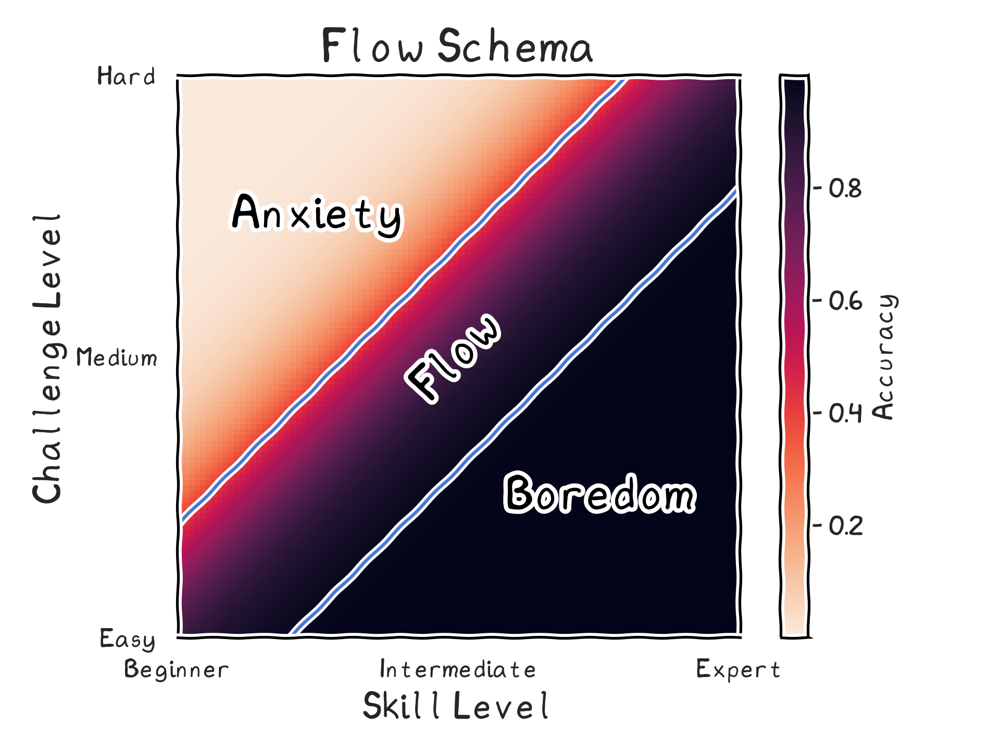

## EdPlace Recommender

I was part of a team that built the recommender [EdPlace](https://www.edplace.com/) uses to recommend content to students. As this is a commercial project, it is not possible to discuss the details of data here, but I can share the main ideas behind the recommender. Even though the EDA can't be shared, please be rest assured we explored distributions of features, looked into PCA, co-linearities, and correlations.

## The Business Problem

At the time of the project, there were over 100,000 students on EdPlace. They have thousands of worksheets, crafted by experienced teachers across maths, science, and English. This amount of content can be overwhelming. **EdPlace recommends a new worksheet to each student** to engage them with new content, improve user experience, and guide students on their learning journey,. The old recommender followed the syllabus. This is a good starting point. However:

1. **The students performance wasn't taken into account**. A struggling student would get identical recommendations to a confident student.
2. **The order was fixed, and imposed by teachers**. It couldn't learn and adapt from paths or connections discovered by students.
3. **This is a one size fits all solution**. Individual differences aren't taken into account.

## The Technical Problem

### What is the best worksheet?

In the case of a film recommender, viewers can rate films. The more stars (from similar users – we’ll return to this) the more likely you should recommend the film. This gives a **clear target**. Having a target is the difference between supervised and unsupervised machine learning.

Ratings don't have the same meaning for worksheets. We needed to **define a target**. We decided that **score** was the best signal we had. However, if we made high score the target, we would only recommend easy worksheets. If low score was the target, students would only get difficult worksheets. We needed something in between.

## Solutions

### A Starting Target

This problem reminded me of [a paper I had read (Wilson et al, 2019)](https://www.nature.com/articles/s41467-019-12552-4). They observe that the optimal accuracy of optimal training is about 85 %. The paper uses artificial neural networks, but does provide references to human and animal learning. In figure 5, they relate this to the model of flow – a well known concept in popular culture. I recreated a schematic here:

They argue that maximal learning occurs in the flow state. We could define a target that is **not too easy, not too hard** – or about **85 % accuracy**. This provides a nice starting point. In reality, we want to modify the difficulty of the worksheet based on how the student is doing at the moment. We can modify the target difficulty to accommodate for the most recent score.

### Collaborative Filtering – Similar Students

We wanted a way to determine the similarity between students that took into account the material they were working on. A simple yet powerful method to determine student similarity was to look at overlap between worksheet completion.

The worksheets completed by any given student can be represented as a set.

$$
A = \{a_1, a_2, a_3, \dots, a_n\}
$$

For a given comparison between any two students, there is one set of worksheets for each student. One way to determine similarity between the two students is the Jaccard index. It is defined as the size of the intersection divided by the size of the union of the sample sets. In our case, the sets are the worksheets completed by students. The Jaccard index is defined as:

$$
J(A, B) = \frac{{|A \cap B|}}{{|A \cup B|}}
$$

This similarity measure is based entirely on the worksheets completed by students. It can be taken as part of a **collaborative filtering** method in the absence of ratings. Similarities between students are based on the content they study. If students discover a novel but effective learning path, when a new student joins, the recommender will help them discover this too. Students sharing a teacher or a specific curriculum will also be recommended class relevant material. As students complete more and more worksheets, the measure improves, learning from the decisions of students.

### K-nearest students

Once a student logs on, a similarity score can be rapidly calculated between them and all other users. This gives us our first dimension. We also included **average score** as another dimension. In combination, the space takes into account skill level and difficulty. The distance can then be taken between the student and all other students in this space. We can select the k-nearest students, where k is a parameter we define. For this example, we can set k to 20, so the 20 nearest students. This would look a bit like this:

")

We could then use the k-nearest students to narrow down the number of worksheets. We took the subset of worksheets completed by those students as the set which could be recommended.

### Recommending one worksheet

We wanted to select the worksheet, with the average score, closest to a target score. We thought the target should be close to 85 %, but it should also be modified by the most recent score.

### Target based on previous score

By making the target score inversely proportional to the previous score, we gave students with low scores target worksheet scores which were high. This meant they would get easy worksheets. This gave us a slope parameter we could define to fine tune this relationship:



### Worksheet closest to the target

We could then put all the scores of our selected worksheets through the following function.



The closer proximity the average score of a worksheet to the target score, higher rank it would have for recommendation. The closest worksheet to target was selected as the recommended worksheet.
